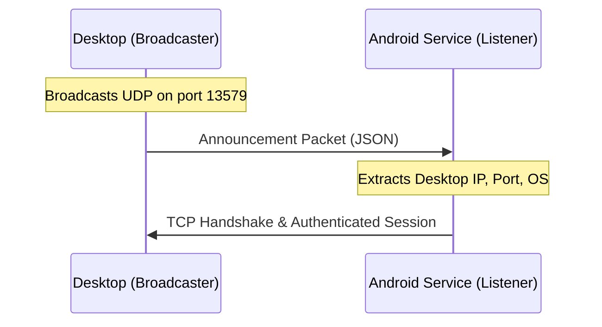

# Android Discovery and Networking Report

This document details the network discovery architecture, continuous scanning mechanism, and foreground service lifecycle implemented in the Android client application.

---

## 1. Discovery Architecture Overview

The discovery protocol uses **UDP Broadcasts** on a dedicated port (`13579`).
- The **Desktop Client** acts as the broadcaster, continuously emitting UDP announcement packets.
- The **Android App** acts as the listener, scanning for these broadcast packets to resolve the desktop's IP address and port, initiating a TCP handshake once detected.



---

## 2. Scanning Mechanism: How Android Searches

To ensure instant responsiveness when the desktop becomes available, the Android client uses a **continuous listening loop** managed by the `DiscoveryScanner`.

### Blocking UDP Reads
Instead of polling at intervals (e.g., checking every 5 seconds), the scanner creates a `DatagramSocket` and executes the blocking `receive()` method inside a loop:

```kotlin
val packet = DatagramPacket(buffer, buffer.size)
sock.receive(packet) // Blocks here until a packet arrives
```

- **Efficiency**: When `receive()` is called, the Android operating system puts the thread to sleep. The OS only wakes it up when a UDP packet is received on port `13579`. As a result, the thread consumes **virtually zero CPU cycles and battery** while waiting.
- **Immediate Recovery**: As soon as the desktop emits a UDP broadcast, the packet is received, and connection setup begins instantly.

### The 1-Second Timeout
The socket configuration includes a timeout:
```kotlin
sock.soTimeout = 1000 // 1 Second
```
This timeout does **not** create a scanning gap. It is simply a safety mechanism:
- If no packet is received for 1 second, a `SocketTimeoutException` is thrown and caught silently.
- The loop immediately checks if the scanner is still active (`running.get()`). If `true`, it immediately blocks on `sock.receive()` again.
- This ensures that when the service is stopped, the thread can exit the loop and close the socket within 1 second.

---

## 3. Background Persistence via Foreground Service

To prevent the Android OS from killing the connection when the app is backgrounded or swiped away, the discovery loop and TCP socket connections are maintained inside a **Foreground Service** (`SyncService`).

- **Persistent Notification**: A non-dismissible notification is shown to the user showing the current connection state (e.g., `"Connected to Adhil's Mac"`).
- **Service Type**: Configured with `foregroundServiceType="connectedDevice"`, aligning with Google Play Store guidelines for network-synchronized utility services.
- **Lifecycle Independent**: Swiping the UI out of the Recents screen terminates the `MainActivity` instance, but the `SyncService` continues running, keeping the TCP session alive and listening for UDP broadcasts.
